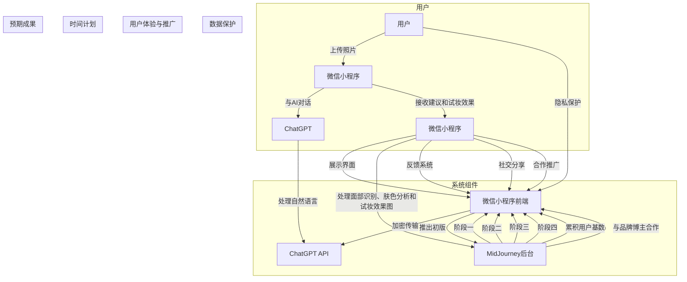
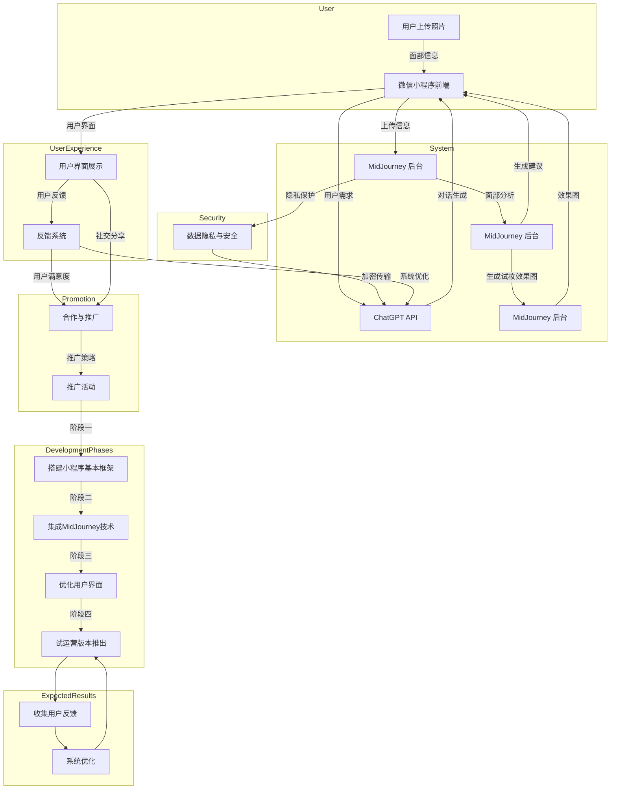

## 用户故事图

```mermaid
graph TD

subgraph 用户
  A[用户] -->|上传照片| B[微信小程序]
  B -->|与AI对话| C[ChatGPT]
  B -->|接收建议和试妆效果| D[微信小程序]
end

subgraph 系统组件
  C -->|处理自然语言| E[ChatGPT API]
  D -->|展示界面| F[微信小程序前端]
  D -->|处理面部识别、肤色分析和试妆效果图| G[MidJourney后台]
end

subgraph 数据保护
  A -->|隐私保护| F
  F -->|加密传输| E
end

subgraph 用户体验与推广
  D -->|反馈系统| F
  D -->|社交分享| F
  D -->|合作推广| F
end

subgraph 时间计划
  G -->|阶段一| F
  G -->|阶段二| F
  G -->|阶段三| F
  G -->|阶段四| F
end

subgraph 预期成果
  F -->|推出初版| G
  G -->|累积用户基数| F
  G -->|与品牌博主合作| F
end
```

## 技术方案流程图

```mermaid
graph TD
  subgraph User
    A[用户上传照片] -->|面部信息| B[微信小程序前端]
  end

  subgraph System
    B -->|用户需求| C[ChatGPT API]
    C -->|对话生成| B
    B -->|上传信息| D[MidJourney 后台]
    D -->|面部分析| E[MidJourney 后台]
    E -->|生成建议| B
    E -->|生成试妆效果图| F[MidJourney 后台]
    F -->|效果图| B
  end

  subgraph Security
    D -->|隐私保护| G[数据隐私与安全]
    G -->|加密传输| C
  end

  subgraph UserExperience
    B -->|用户界面| H[用户界面展示]
    H -->|用户反馈| I[反馈系统]
    I -->|系统优化| C
  end

  subgraph Promotion
    I -->|用户满意度| J[合作与推广]
    H -->|社交分享| J
    J -->|推广策略| K[推广活动]
  end

  subgraph DevelopmentPhases
    K -->|阶段一| L[搭建小程序基本框架]
    L -->|阶段二| M[集成MidJourney技术]
    M -->|阶段三| N[优化用户界面]
    N -->|阶段四| O[试运营版本推出]
  end

  subgraph ExpectedResults
    O --> P[收集用户反馈]
    P --> Q[系统优化]
    Q --> O
  end
```